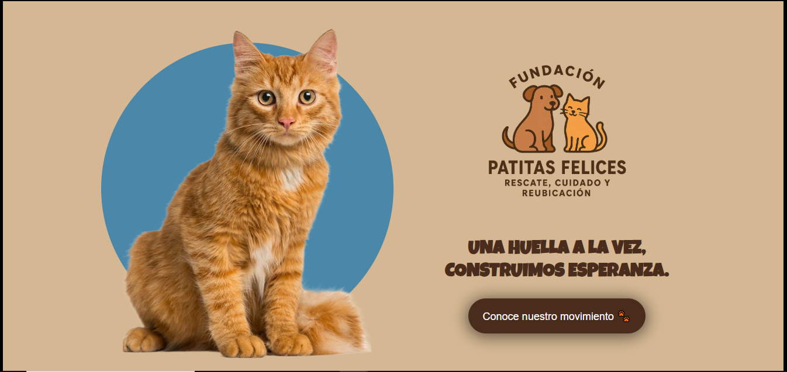
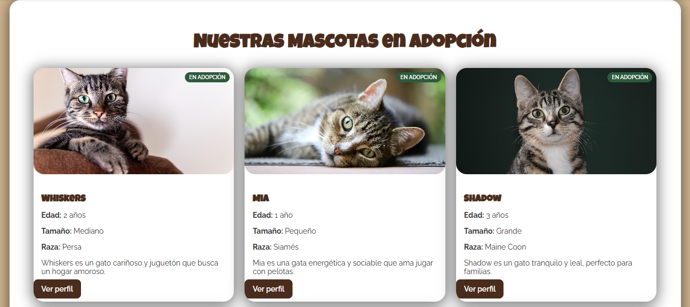
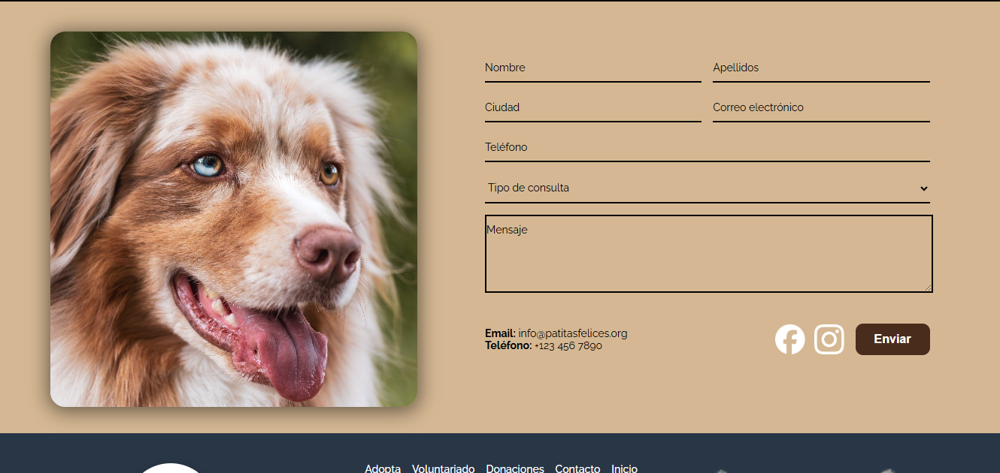

# Patitas Felices - Fundación de Rescate y Adopción de Animales

## Descripción del Proyecto

La Fundación Patitas Felices es una organización dedicada al rescate, cuidado y reubicación de animales en situación de abandono. Este proyecto consiste en una maqueta web estática desarrollada con HTML y CSS nativo, diseñada para ampliar la presencia digital de la fundación. La maqueta refleja la misión, historia, esfuerzos de adopción y vías de contacto con la comunidad, siendo visualmente atractiva, accesible y responsive. Simula componentes interactivos mediante CSS puro, sin el uso de JavaScript.

El objetivo principal es transmitir la identidad de la fundación, facilitar la comprensión de cómo ayudar, mostrar animales disponibles para adopción y proporcionar formas de contactar a la organización.

**Nota:** Este proyecto se realizó una vez que el docente aprobó los wireframes necesarios para iniciar la ejecución en código.

## Requerimientos Funcionales

### Página de Inicio (Home)
- **Banner Principal:** Nombre de la fundación, logo o marca textual y un slogan claro. Incluye un botón de llamada a la acción (ej. “Conócenos” o “Adopta”).
- **Carrusel de Fotografías:** Muestra imágenes de animales, voluntariado y actividades. Cambia automáticamente cada 3 segundos mediante CSS (@keyframes).
- **Secciones Destacadas:** Resumen de la labor de la fundación. Botones/links internos a “Adopta”, “Donaciones”, “Voluntariado” y “Contacto”.
- **Visión y Misión:** Aparecen lateralmente en pantallas grandes y se apilan en mobile. Cada bloque incluye título, icono o imagen pequeña y texto explicativo.
- **Galería / Carrusel Secundario:** Mosaico o carrusel simulado con fotos de rescates y eventos, responsive y manteniendo proporciones.

### Animales Disponibles / Adoptar (Catálogo Simple)
- Grid de tarjetas con animales (mínimo 8 ejemplos representativos).
- Cada tarjeta muestra: imagen, nombre, edad aproximada, tamaño/raza, estado (disponible/adoptado) y botón “Ver perfil”.
- No requiere lógica de filtro ni backend; es una maqueta estática que muestra distintos estados.

### Perfil de Animal (Detalle Estático)
- Vista ampliada con foto grande, descripción (historia, salud, comportamiento), características (edad, sexo, tamaño).
- Call-to-action “Solicitar adopción” (no funcional).
- Sección opcional de “animales relacionados” en carrusel horizontal.

### Formulario de Contacto
- Campos obligatorios: Nombre, Apellidos, Ciudad, Correo electrónico, Teléfono (opcional), Tipo de consulta (select), Mensaje.
- Validación visual con CSS: Indica campos vacíos o con formato incorrecto mediante estilos (pseudoclases y estados simulados).
- Información de contacto directo (correo, teléfono) y links a redes sociales.

### Footer
- Nombre de la fundación, Año + Copyright, Correo de contacto, Enlace al desarrollador o equipo (ficticio).
- Implementado con Flexbox, diseño limpio y claro.

## Instrucciones de Ejecución

1. **Requisitos Previos:**
   - Navegador web moderno (Chrome, Firefox, Safari, Edge).
   - No se requieren dependencias adicionales, ya que es una maqueta estática.

2. **Ejecución:**
   - Descarga o clona el repositorio.
   - Abre el archivo `index.html` en tu navegador web.
   - Navega por las páginas: `index.html` (inicio), `catalogo.html` (adopciones), `contacto.html` (contacto).

3. **Estructura del Proyecto:**
   - `index.html`: Página de inicio.
   - `catalogo.html`: Catálogo de animales disponibles.
   - `contacto.html`: Formulario de contacto.
   - `css/`: Archivos de estilos CSS (styles.css, catalogo.css, contacto.css, tablet.css, celular.css).
   - `img/`: Imágenes utilizadas en el sitio.
   - `capturas/`: Capturas de pantalla de las vistas principales.

## Capturas de Pantalla

### Página de Inicio

### Catálogo de Animales

### Formulario de Contacto

## Tecnologías Utilizadas
- HTML5
- CSS3 (Flexbox, Grid, Animaciones con @keyframes)
- Diseño Responsive (Media Queries para tablet y mobile)

## Autor
Desarrollado por David Orozco como parte del proyecto académico.
